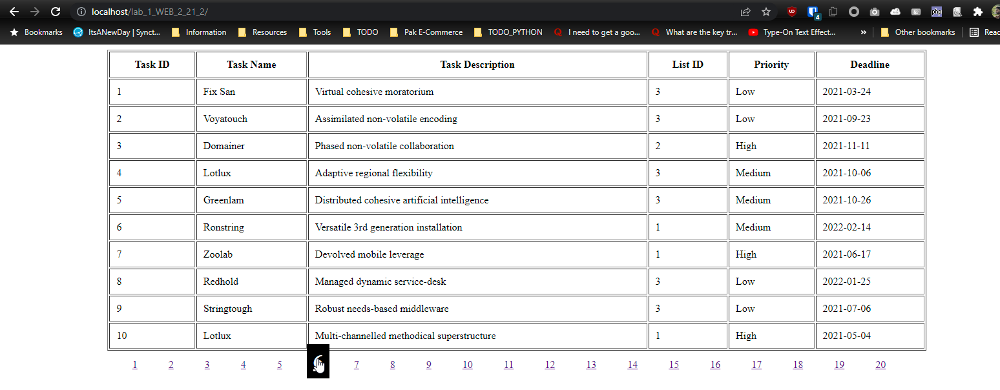
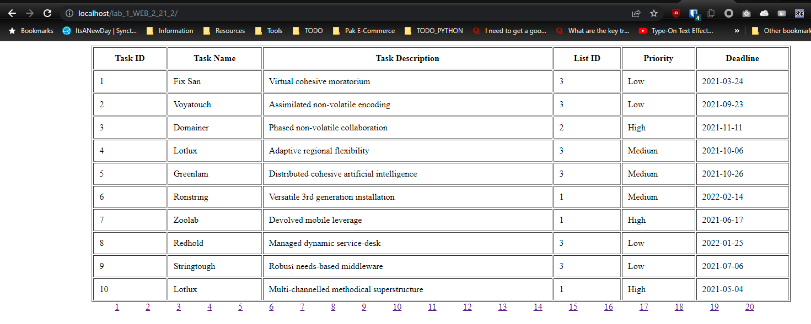

# LAB 01: PHP Pagination

Lab Objectives:
1. Revise Database concepts in MySQL
2. Apply pagination on PHP Database

Software Required:
- vscode

### Creating Pagination with PHP and MySQL

PHP is mostly used to store and display data from a database. Pagination is much robust with ajax, but here it is done wihtout it. 

In this tutorial, we will learn the pagination in PHP with MySQL. Let's take a brief review about pagination with an example.

Pagination is a common task for PHP developers. MySQL helps the developer to create pagination by using LIMIT clause, which takes two arguments. The first argument is OFFSET and the second argument is number of records that will return from database.

### Database Setup.
You can import the provided `tbl_tasks.sql` file to populate the data base with fake data that can be used in this example.

The file will create the following columns in the database (please review the SQL statement).

```SQL
CREATE TABLE `tbl_tasks` (
  `task_id` int(10) UNSIGNED NOT NULL,
  `task_name` varchar(150) NOT NULL,
  `task_description` text NOT NULL,
  `list_id` int(11) NOT NULL,
  `priority` varchar(10) NOT NULL,
  `deadline` date NOT NULL
) ENGINE=InnoDB DEFAULT CHARSET=utf8mb4;
```

### Screenshots





